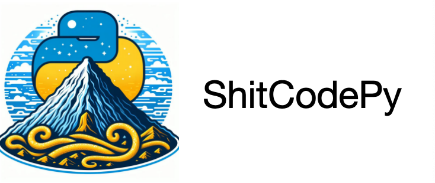

# 💩ShitCodePy💩
***************************************



***************************************
Language: [English](README.md) | [简体中文](README_zh.md)
***************************************
## Get the Badge
If your repository uses 💩ShitCodePy💩, you can add a badge to your README.md to show that your project adheres to the ShitCodePy standard.


Engineering projects that adhere to the ShitCodePy standard will become very artistic, which will highlight the ShitCode artistic temperament. You can obtain the badge by using the following Markdown code.
```markdown

```
***************************************

## Preface
With the rapid development of AI technology, it is soon expected to replace many human jobs, leading to increased unemployment rates in some industries, including programmers. Recently, many large tech companies and startups have begun using AI to create virtual programmers, causing great anxiety among my friends.

By chance, I discovered that ShitCode could help alleviate this problem. If a project contains a large amount of ShitCode, it appears as a mountain of ShitCode, which is quite artistic. More importantly, it becomes harder for AI programmers to understand and maintain these projects, turning heavily ShitCode-compliant projects into useless samples that increase the cost of learning and training for AI programmers.

This astonishing discovery made me revisit my ShitCode coding career, which has been a very arduous journey.

There’s a saying in the ShitCode community: ‘Writing good ShitCode requires talent and effort,’ and I deeply agree. Looking around at friends and colleagues, they all possess profound coding skills and good coding habits, making it very difficult for them now to write excellent ShitCode.

Therefore, I decided to create this project, hoping to spread the coding skills of ShitCode so that more friends can quickly learn how to write excellent ShitCode. Python is one of my favorite programming languages and is also one of the most widely used, so I decided to focus on Python and named it ShitCodePy.

## Project description
* This project will provide any coding standards, techniques, tools, and examples related to ShitCode in the Python language;
* Many parts of the foreword are described in a joking manner, so please don’t take them seriously; if you are a Python beginner or a serious Python developer, please use this project as a negative example for learning;
* I hope that one day this project can become the ShitCode art bible for all Python developers;


Let’s start the journey of ShitCodePy!