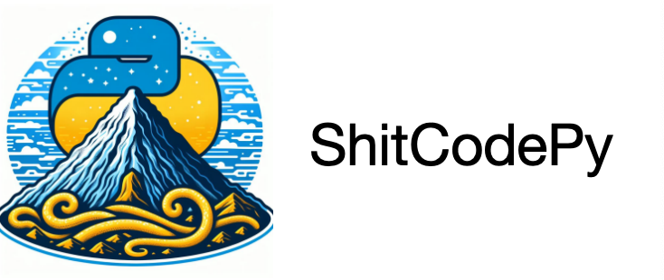

# 💩ShitCodePy💩
***************************************



***************************************
语言: [English](README.md) | [简体中文](README_zh.md)
***************************************
## 获得徽章
如果你的仓库中使用了💩ShitCodePy💩，你可以在你的README.md中添加徽章，以展示你的项目使用了ShitCodePy规范。


使用了ShitCodePy规范的工程项目将变得非常艺术，这将会彰显ShitCode艺术气质，使用以下代码即可获得徽章：
```markdown

```
***************************************

## 前言
随着AI技术的飞速发展，AI技术将很快替代许多人类的工作，这将会导致部分行业的失业率的上升，程序员就是其中之一。
近期已经许多大型科技公司与创业公司开始使用AI技术来创建虚拟程序员，这让我的朋友们非常焦虑。
无意之中，我发现了ShitCode可以帮助我们缓解这个问题。如果一个项目中有大量的ShitCode，那么这个项目看起来就像一堆ShitCode堆积成山，这非常的艺术。
更重要的是AI程序员也更难理解与维护这些项目，大量使用ShitCode规范的工程也将变为无用的样本以增加AI程序员学习训练的成本。
这一惊人的发现让我重新回顾起我的ShitCode编码生涯，这是一段非常艰辛的经历。

在ShitCode界一直流传着一句话:"写好ShitCode需要天赋与努力"，本人深感赞同。
回看周围的朋友与同事，他们都拥有非常深厚的编码能力与良好的编码习惯，现在让他们去写出优秀的ShitCode是非常困难的。

因此我决定创建本项目，希望能够将ShitCode的编码技能传播出去，让更多的朋友能够体会快速学会如何写出优秀的ShitCode。
python是我最喜欢的编程语言之一，也是使用非常广泛的编程语言之一，因此我决定以python为主题，取名ShitCodePy。

本人在ShitCode领域的学识有限，欢迎更多的朋友提供您的python开发好习惯，加入与我一同共建本项目。

## 说明
* 本项目会提供任何python语言相关的ShitCode的编码规范、技巧、工具及案例；
* 前言中的许多部分都是以开玩笑的方式进行描述，希望大家不要当真；如果你是一个python初学者或者正经的python开发者，请把本项目当成反面教材学习；
* 希望本项目有一天能够成为所有python开发者ShitCode艺术宝典;

让我们开始ShitCodePy之旅吧！